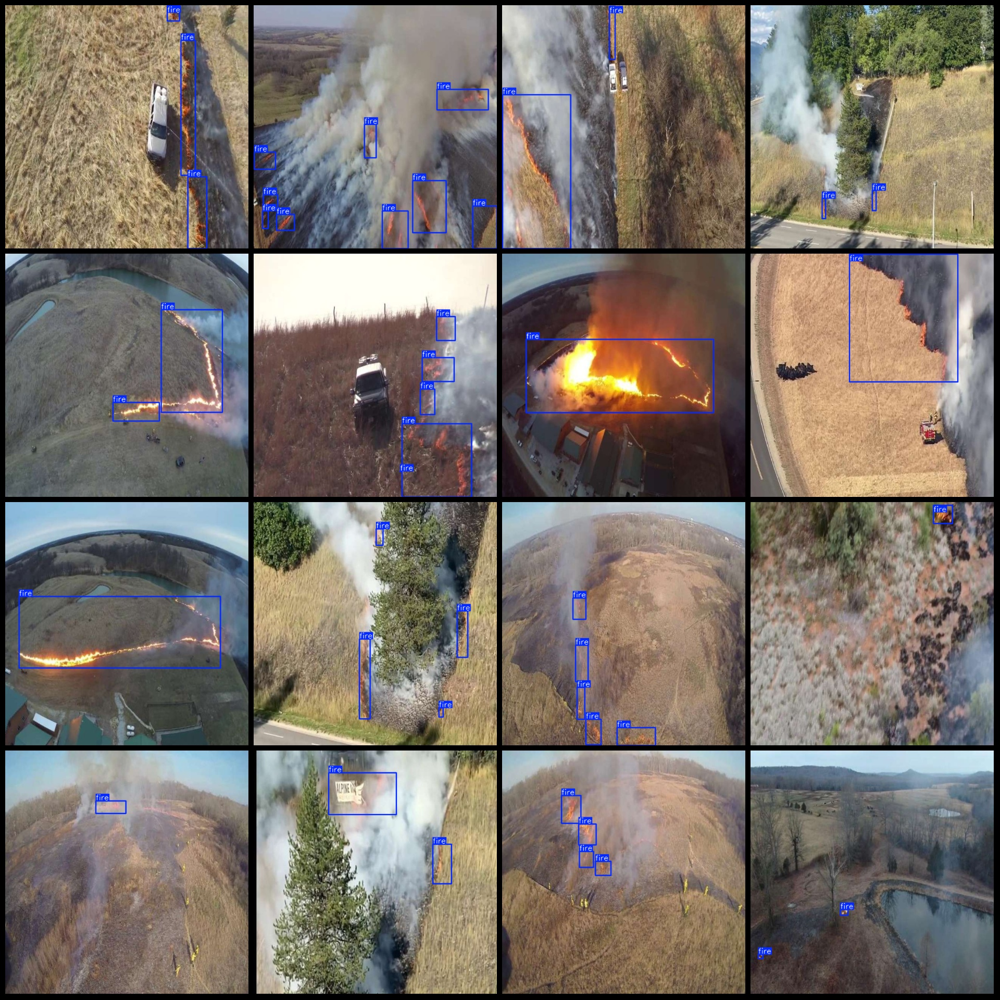
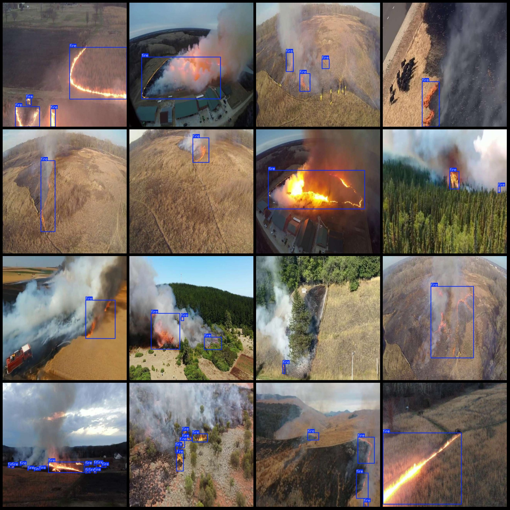

# UAV Perspective Crop Burning Straw Fire Spot Detection Dataset VOC+YOLO Format 4491 Images in 1 Category

Note: The dataset was extracted from multiple video segments, which results in repetitive images (actually continuous frames). Only fire spots are labeled, without smoke.

Dataset format: Pascal VOC format + YOLO format (txt files without split paths, only containing jpg images along with corresponding VOC format xml files and yolo format txt files).
Image count (number of jpg files): 4491
Annotation count (xml file count): 4491
Annotation count (txt file count): 4491
Annotation category count: 1
Annotation category name: ["fire"]
Each category has annotations for:
- fire boxes = 13101
Total boxes = 13101
Image resolution: 640x640
UAV: DJI MAVIC 3
Collection height: 20m
Collection angle: 60°
Annotation tool used: labelImg
Annotation rules: drawing boxes for categories
Important note: The dataset does not have a training/validation/test split; it needs to be manually divided.
Special declaration: This dataset does not guarantee the accuracy of models or weights files trained on it.
Image previews:
Annotation examples:

## Image

Here is a pay link on Stripe ( https://buy.stripe.com/3cs8yP7sY87d0vu9AB ). Please contact me lonlonago@foxmail.com after funding $89, and I will send you a complete data files , thank you!

